# TP3 - SEC108

Installation d'un serveur sécurisé Ubuntu 20.04

* `config_files` contient les fichiers de configuration (ngix, sshd, etc.) déployés sur le système
* `ressources` contient les captures d'écran utilisés dans le README

## Création de la machine virtuelle

La machine virtuelle est créée sur mon serveur Proxmox personnel. 

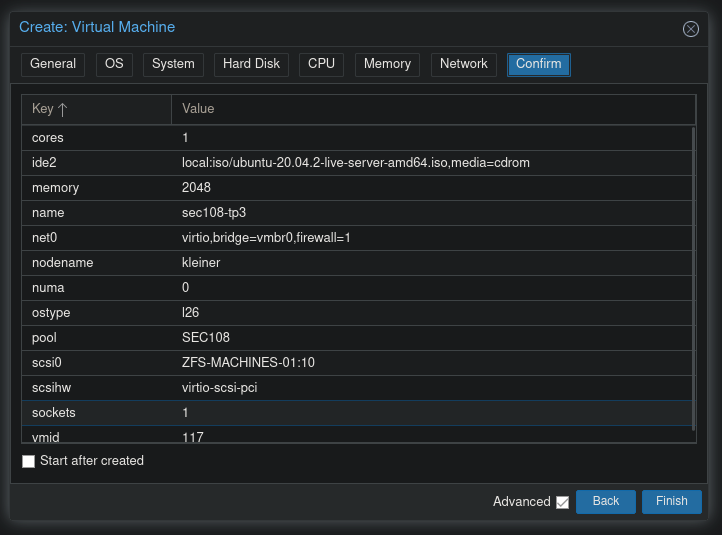

## Installation d'ubuntu server

Durant le processus d'installation d'ubuntu server, je sélectionne le partitionnement manuel des disques. 

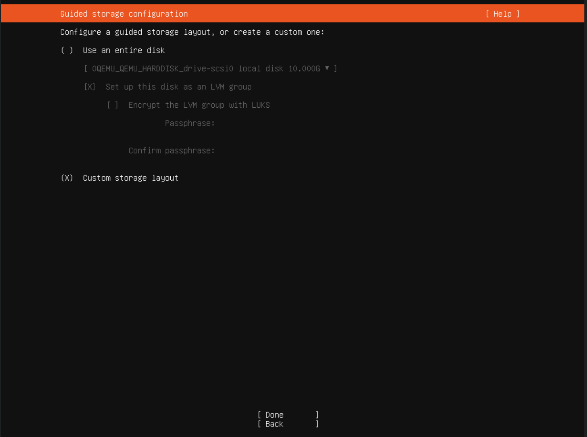

Les partitions demandées sont créées à partir de l'espace libre. L'espace restant est alloué à la partition principale (root). La partition home est créée à partir d'un volume logique chiffré.

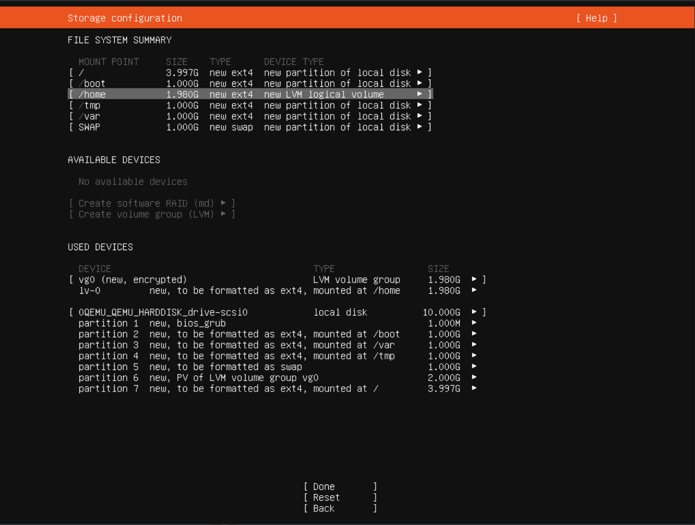

Ubuntu propose également d'installer openssh server qui sera utilisé par le suite pour configurer la machine. 

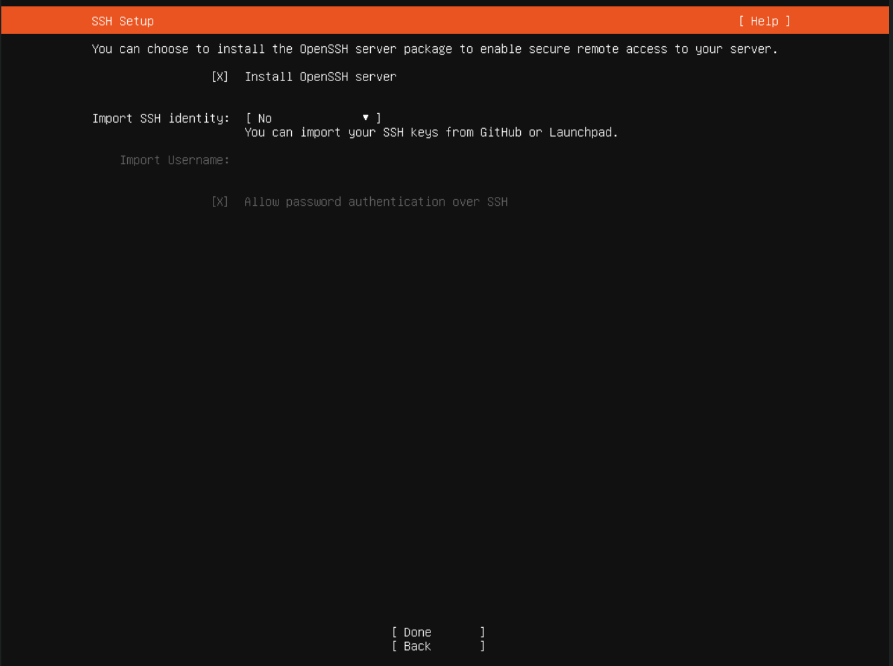

## Configuration de la machine

### Partitions

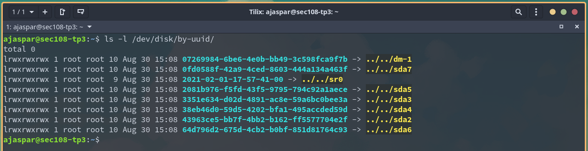

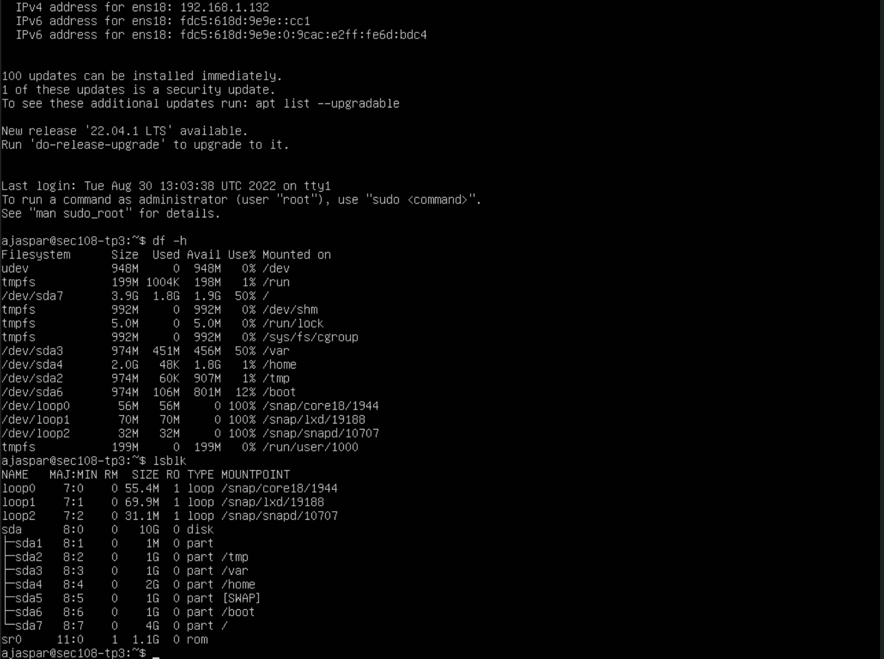

### Mises à jours

Ensuite, on configure les mises à jours de sécurité automatiques:

```
sudo dpkg-reconfigure --priority=low unattended-upgrades
```

On peut ensuite vérifier qu'elles sont bien actives:

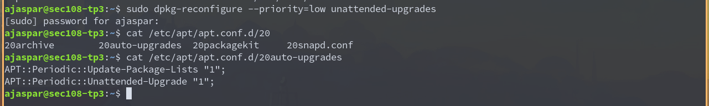


### Umask

Pour renforcer la sécurité du système, on peut réduire les droits par défauts des fichiers créés via la modification du umask. Par défaut, le umask pour les fichiers est de `022` ce qui implique que les fichiers sont lisibles par tout le monde mais uniquement modifiables par le propriétaire. En appliquant un umask de `077` on rend les fichiers uniquement lisibles et modifiables par le propriétaire. 

On rajoute alors `umask 077` dans le `/etc/profile` pour charger cette modification dans chaque session utilisateur lors de la connexion / l'ouverture. 

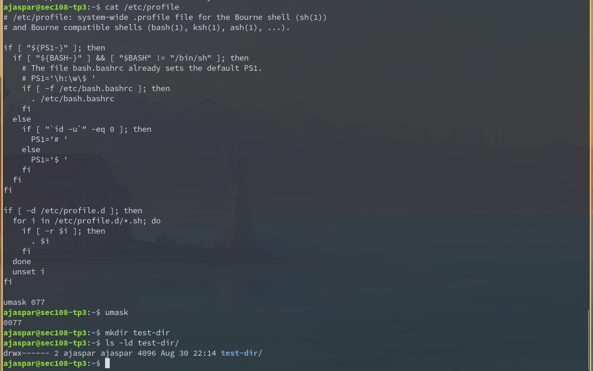

### Ajout de l'utilisateur cnam

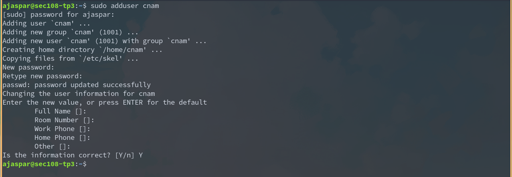

### Configuration SSH

#### Génération et copie des clés

On génère une clé ssh RSA de 2048 bits. On préfèrera aujourd'hui utiliser des clés RSA de 4096bits ou des clés elliptiques de 512bits (ed25519).

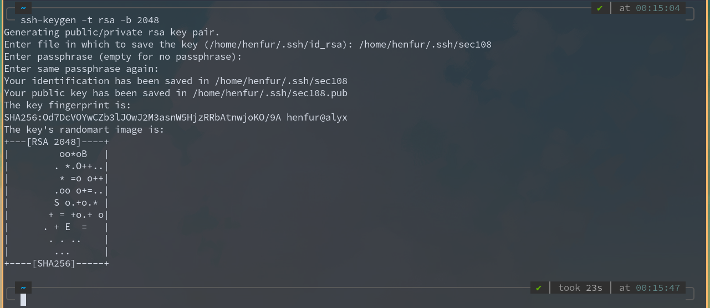

La clé publique peut ensuite être copiée vers le serveur via l'utilitaire `ssh-copy-id` :

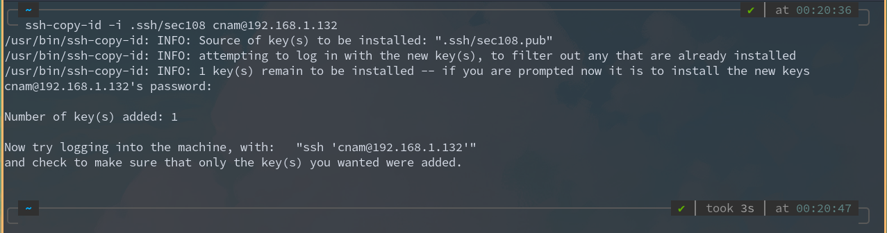

#### Configuration cliente

Pour renre la connexion au serveur plus simple, on peut créer une configuration ssh rapide sur le client pour prédéfinir tous les paramètres de connexion.

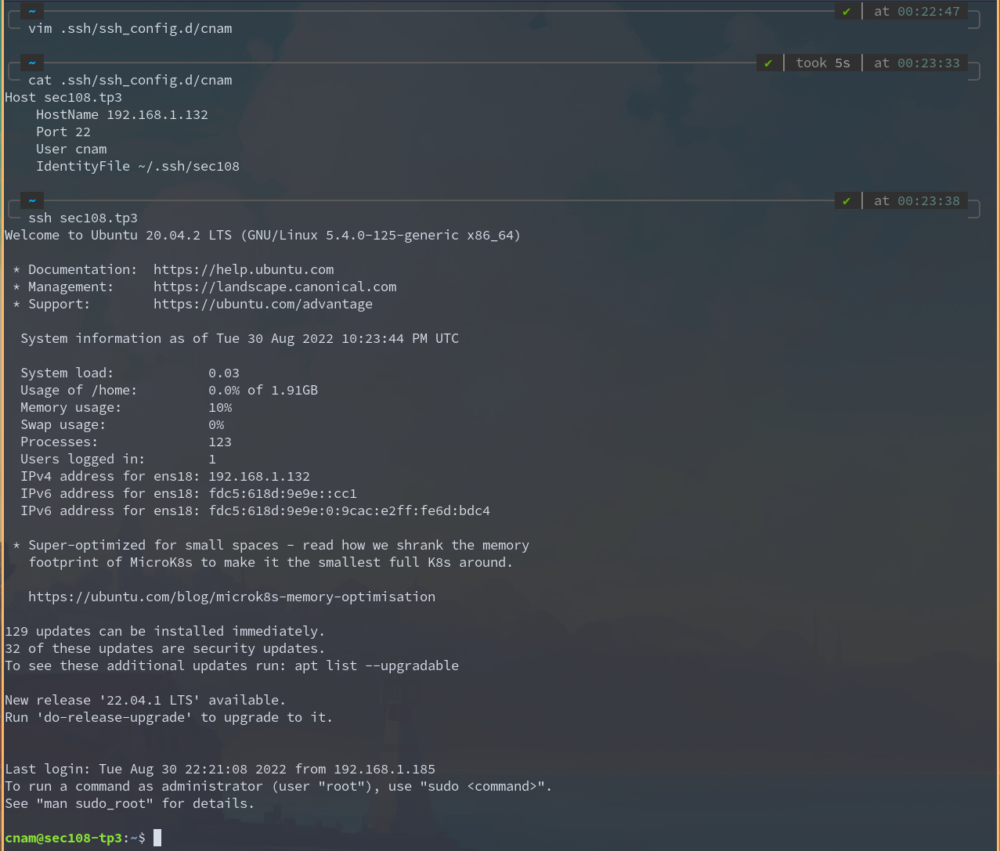

*(Note: Le port SSH côté serveur a été modifié côté serveur dans la suite du TP et a également été mis à jour dans la configuration client)*

#### Configuration serveur

La configuration par défaut de `sshd` est assez permissive (notamment pour permettre la connexion initiale), il est donc nécessaire de la modifier pour la renforcer. Ici nous appliquerons quelques bonnes pratiques de configurations sshd: 

* Changement du port par défaut (22 -> 56867) pour ralentir les détections par des scans de ports (surtout sur les ports usuels 1-1024).
* Désactivation de la connexion SSH de l'utilisateur root. La connexion SSH doit généralement se faire par un utilisateur nominatif ou spécifique à une tâche. Les actions qui requièrent les privilèges root seront exécutés via `sudo`.
* Réduction du nombre de tentatives de connexions.
* Désactivation de l'authentification par mot de passe et remplacement par authentification par paire de clé privée et clé publique.
* Désactivation des fonctionnalités non utilisés (X11 forwarding, tunneling, TCP forwarding...)

### Iptables

On installe `iptables-persistent` pour appliquer les règles de FW au démarrage de la machine: 

```
sudo apt install iptables-persistent
```

On peut ensuite écrire un simple script pour appliquer chaque règle iptables et les sauvegarder.

```bash
#!/bin/bash
iptables -F
iptables -X

ip6tables -F
ip6tables -X

iptables -t filter -A INPUT -i lo -j ACCEPT
iptables -t filter -A INPUT -m state --state ESTABLISHED -j ACCEPT
iptables -t filter -A INPUT -p tcp -m multiport --dports 80,443 -m conntrack --ctstate NEW,ESTABLISHED -m comment --comment "HTTP/HTTPS" -j ACCEPT
iptables -t filter -A INPUT -s 192.168.1.185/32 -p tcp -m tcp --dport 56867 -m conntrack --ctstate NEW,ESTABLISHED -m comment --comment "SSH" -j ACCEPT

ip6tables -P INPUT DROP
ip6tables -P FORWARD DROP

iptables -P INPUT DROP
iptables -P FORWARD DROP
```

`192.168.1.185` est l'IP de ma machine utilisée pour administrer le serveur via SSH.

On sauvegarde ces règles dans un fichier avec `iptables-save`:

```
sudo iptables-save | sudo tee /etc/iptables/rules.v4
sudo ip6tables-save | sudo tee /etc/iptables/rules.v6
```

On peut ensuite vérifier que les règles sont bien appliquées:

```
sudo iptables -L -n -v -t filter
sudo ip6tables -L -n -v -t filter
```

### Fail2Ban

```bash
sudo apt install fail2ban
sudo systemctl enable fail2ban
```

Configuration: 

*jail.conf*
```
ignoreip = 127.0.0.1/8 ::1 192.168.1.185/32
bantime = 24h
findtime = 10m
maxretry = 3
```

Debian inclut une configuration par défaut qui active la jail SSHD: 

*/etc/fail2ban/jail.d/defaults-debian.conf*
```
[sshd]
enabled = true
```

On peut maintenant essayer une connexion depuis 